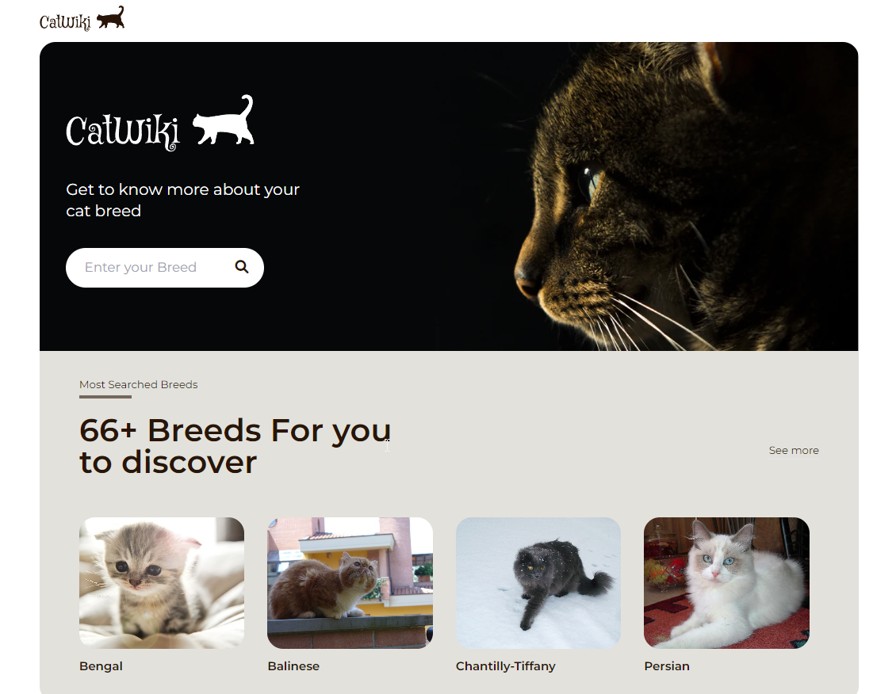

<h1 align="center">Cat Wiki</h1>

<div align="center">
   Solution for a challenge from  <a href="http://devchallenges.io" target="_blank">Devchallenges.io</a>.
</div>

<div align="center">
  <h3>
    <a href="" target="_blank">
      Demo
    </a>
    <span> | </span>
    <a href="" target="_blank">
      Solution
    </a>
    <span> | </span>
    <a href="https://devchallenges.io/challenges/f4NJ53rcfgrP6sBMD2jt" target="_blank">
      Challenge
    </a>
  </h3>
</div>

<!-- TABLE OF CONTENTS -->

## Table of Contents

- [Overview](#overview)
- [Installation](#installation)
- [Built With](#built-with)
- [Features](#features)
- [Acknowledgements](#acknowledgements)

<!-- OVERVIEW -->

## Overview



#### Installation:

1.  Clone the repository:

    ```bash
    git clone https://github.com/render217/CatWiki
    ```

2.   Create a .env file in backend/config folder and add the following as key = value

            ```
            PORT = 2121 (can be any port example: 3000)
            MONGO_CLOUD_URI = your database URI
            ```
      Create a .env file in frontend directory and add the following as key = value
      ```
        VITE_BACKEND_URL = localhost:PORT/api/v1/images 
        
        N.B(PORT => port you used for the backend)
      ```

3.  Navigate into the directory and install dependencies: both in frontend and backend folder

    ```bash
    npm install
    ```

4.  Start the development server: in both client and backend folder
    ```bash
    npm run dev
    ```

### Built With

<!-- This section should list any major frameworks that you built your project using. Here are a few examples.-->

- **React**
- **Tailwind**
- **Express**

## Features

<!-- List the features of your application or follow the template. Don't share the figma file here :) -->

This application/site was created as a submission to a [DevChallenges](https://devchallenges.io/challenges) challenge. The [challenge](https://devchallenges.io/challenges/wBunSb7FPrIepJZAg0sY) was to build an application to complete the given user stories.

- User story: I can search for cat breeds and select a breed of my choice
- User story: I can see the most popular searched cat breeds summary on the homepage
- User story: I can see the top 10 most searched cat breeds
- User story: I can see the breed details including description, temperament, origin, life span, adaptability, affection level, child-friendly, grooming, intelligence, health issues, social needs, stranger friendly
- User story: I can see more photo of the breed
- User story: On mobile, when I select the search option, a modal for breed search should pop up
- User story (optional): I can go to an article about cats when I click read more on Why you should have a cat section
- User story (optional): I can go to the top 10 cats by clicking see more in the dashboard

## Acknowledgements

- [Vercel](https://vercel.com/) - For frontend deployment
- [Render](https://render.com) - For backend deployment
- [fontawesome](https://fontawesome.com)
- [thecatapi](https://developers.thecatapi.com/) - all the data were taken from their api
